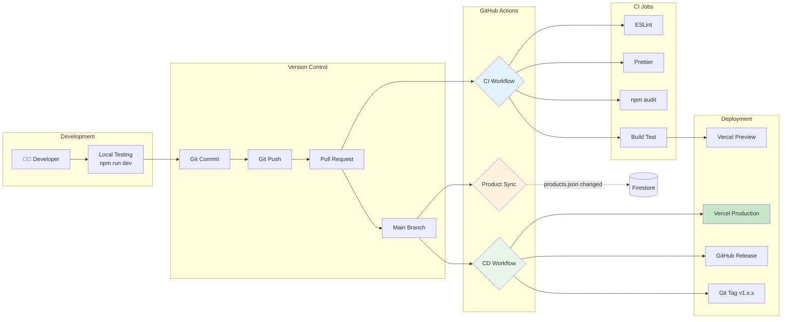
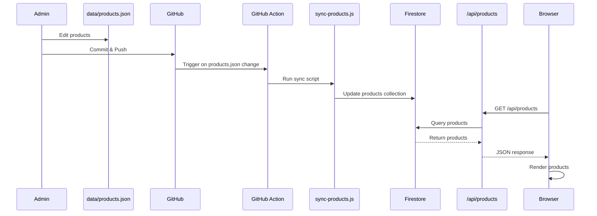
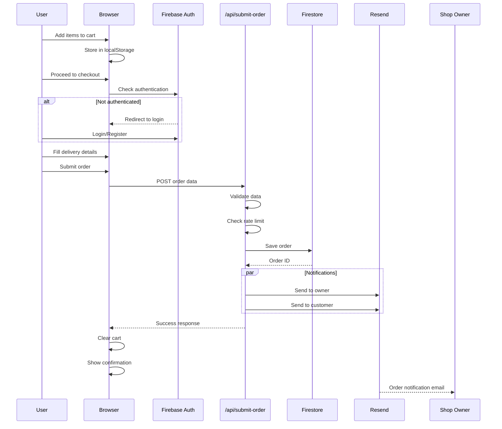
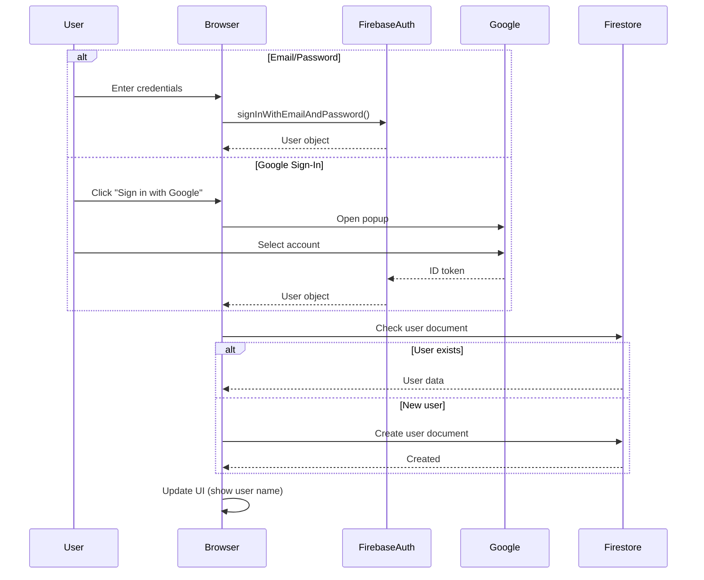
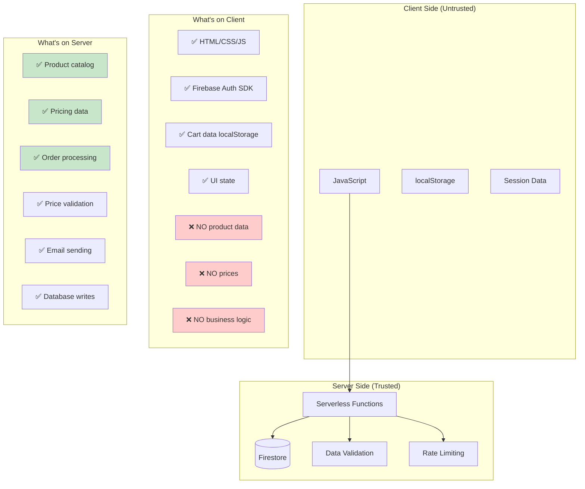
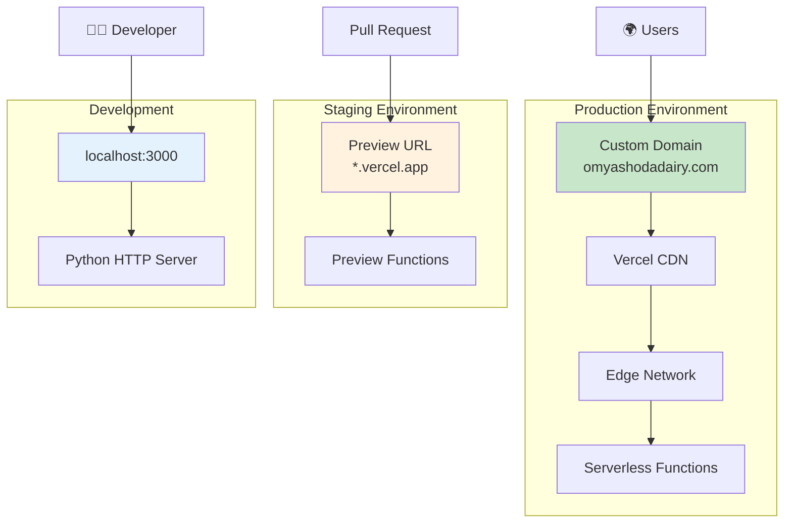
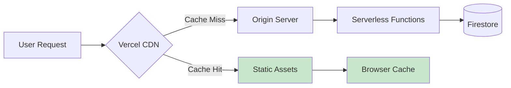

# Architecture Documentation

Complete system architecture for OM Yashoda Dairy website.

---

## System Architecture

```mermaid
graph TB
    subgraph "Client Side (Browser)"
        User[👤 User]
        Browser[Web Browser]
        HTML[HTML Pages]
        CSS[CSS Styles]
        JS[JavaScript Modules]
        Cart[LocalStorage Cart]
    end

    subgraph "Authentication"
        FirebaseAuth[Firebase Authentication]
        GoogleAuth[Google Sign-In]
        EmailAuth[Email/Password]
    end

    subgraph "Vercel Serverless Functions"
        ProductAPI[/api/products]
        OrderAPI[/api/submit-order]
        EmailAPI[/api/email-owner]
    end

    subgraph "Database"
        Firestore[(Firestore DB)]
        ProductsColl[products collection]
        UsersColl[users collection]
        OrdersColl[orders collection]
    end

    subgraph "External Services"
        Resend[Resend Email API]
        Twilio[Twilio WhatsApp - DISABLED]
    end

    subgraph "CI/CD & Deployment"
        GitHub[GitHub Repository]
        Actions[GitHub Actions]
        Vercel[Vercel Hosting]
    end

    User --> Browser
    Browser --> HTML
    Browser --> CSS
    Browser --> JS
    JS --> Cart
    JS --> FirebaseAuth
    FirebaseAuth --> GoogleAuth
    FirebaseAuth --> EmailAuth
    
    JS --> ProductAPI
    JS --> OrderAPI
    
    ProductAPI --> Firestore
    OrderAPI --> Firestore
    OrderAPI --> Resend
    OrderAPI -.->|Disabled| Twilio
    OrderAPI --> EmailAPI
    EmailAPI --> Resend
    
    Firestore --> ProductsColl
    Firestore --> UsersColl
    Firestore --> OrdersColl
    
    GitHub --> Actions
    Actions --> Vercel
    Vercel --> ProductAPI
    Vercel --> OrderAPI

    style Twilio fill:#ffcccc,stroke:#ff0000,stroke-dasharray: 5 5
    style ProductAPI fill:#e3f2fd
    style OrderAPI fill:#e3f2fd
    style EmailAPI fill:#e3f2fd
    style Firestore fill:#fff3e0
    style FirebaseAuth fill:#e8f5e9
```

---

## CI/CD Pipeline



---

## Data Flow

### 1. Product Data Flow



### 2. Order Flow



### 3. Authentication Flow



---

## Security Architecture

### Client-Server Separation



---

## Technology Stack

### Frontend
- **HTML5** - Semantic markup
- **CSS3** - Custom properties, Grid, Flexbox
- **Vanilla JavaScript** - ES6+ modules
- **Firebase SDK** - Authentication (client-side)

### Backend
- **Vercel Serverless Functions** - Node.js 18
- **Firebase Admin SDK** - Server-side operations
- **Firestore** - NoSQL database

### External Services
- **Firebase Authentication** - User management
- **Resend** - Email delivery
- **Twilio** - WhatsApp (disabled, ready to enable)

### DevOps
- **GitHub** - Version control
- **GitHub Actions** - CI/CD automation
- **Vercel** - Hosting & deployment
- **ESLint** - Code linting
- **Prettier** - Code formatting

---

## Deployment Architecture



---

## File Structure

```
dairy-webapp/
├── api/                          # Serverless functions
│   ├── products.js              # GET products from Firestore
│   ├── submit-order.js          # POST order processing
│   └── email-owner.js           # Email notification helper
│
├── js/                          # Frontend JavaScript
│   ├── config.js                # App configuration
│   ├── firebase-config.js       # Firebase initialization
│   ├── products.js              # Product fetching (from API)
│   ├── cart.js                  # Cart management
│   ├── checkout.js              # Checkout logic
│   └── utils.js                 # Utilities
│
├── css/                         # Stylesheets
│   ├── variables.css            # CSS custom properties
│   ├── reset.css                # CSS reset
│   ├── global.css               # Global styles
│   ├── components.css           # Component styles
│   └── pages.css                # Page-specific styles
│
├── data/                        # Data files
│   └── products.json            # Product source of truth
│
├── scripts/                     # Utility scripts
│   └── sync-products.js         # Sync products to Firestore
│
├── docs/                        # Documentation
│   ├── database-schema.md       # Database schema
│   └── architecture.md          # This file
│
├── .github/workflows/           # GitHub Actions
│   ├── ci.yml                   # Continuous Integration
│   ├── deploy.yml               # Continuous Deployment
│   └── sync-products.yml        # Product sync automation
│
├── index.html                   # Homepage
├── products.html                # Product catalog
├── checkout.html                # Checkout page
├── confirmation.html            # Order confirmation
│
├── package.json                 # Dependencies & scripts
├── vercel.json                  # Vercel configuration
├── .env.example                 # Environment variables template
├── README.md                    # Project documentation
├── SETUP.md                     # Setup guide
├── DEPLOYMENT.md                # Deployment guide
└── CHANGELOG.md                 # Version history
```

---

## Performance Optimization

### Caching Strategy



### Optimization Techniques
- **Static assets** cached at CDN edge
- **Products API** cached for 5 minutes
- **Images** lazy loaded
- **JavaScript** ES6 modules (tree-shaking)
- **CSS** minimal, no frameworks
- **Firestore** indexed queries

---

## Monitoring & Logging

### What We Monitor

1. **Vercel Dashboard**
   - Deployment status
   - Function execution time
   - Error rates
   - Bandwidth usage

2. **Firebase Console**
   - Authentication metrics
   - Firestore usage
   - Security rule violations

3. **GitHub Actions**
   - CI/CD pipeline status
   - Product sync logs
   - Test results

4. **Application Logs**
   - Order submissions
   - Email delivery
   - API errors

---

## Scalability Considerations

### Current Capacity
- **Concurrent users:** 100-500
- **Orders/day:** 10-50
- **Products:** 12-50
- **Database size:** ~20 MB/year

### Scaling Strategy
1. **Horizontal:** Vercel auto-scales functions
2. **Database:** Firestore auto-scales
3. **CDN:** Global edge network
4. **Caching:** Reduce database reads

### Future Enhancements
- Redis cache for hot products
- Image CDN (Cloudinary)
- Admin dashboard
- Analytics integration
- Payment gateway

---

**Last Updated:** 2026-02-13  
**Version:** 1.0.0
