# Architecture Documentation

Complete system architecture for OM Yashoda Dairy website.

---

## System Architecture

```mermaid
graph TB
    subgraph "Client Side (Browser)"
        User[👤 User]
        Browser[Web Browser]
        HTML[HTML Pages]
        CSS[CSS Styles]
        JS[JavaScript Modules]
        Cart[LocalStorage Cart]
    end

    subgraph "Authentication"
        FirebaseAuth[Firebase Authentication]
        GoogleAuth[Google Sign-In]
        EmailAuth[Email/Password]
    end

    subgraph "Vercel Serverless Functions"
        ProductAPI[/api/products]
        OrderAPI[/api/submit-order]
        EmailAPI[/api/email-owner]
    end

    subgraph "Database"
        Firestore[(Firestore DB)]
        ProductsColl[products collection]
        UsersColl[users collection]
        OrdersColl[orders collection]
    end

    subgraph "External Services"
        Resend[Resend Email API]
        Twilio[Twilio WhatsApp - DISABLED]
    end

    subgraph "CI/CD & Deployment"
        GitHub[GitHub Repository]
        Actions[GitHub Actions]
        Vercel[Vercel Hosting]
    end

    User --> Browser
    Browser --> HTML
    Browser --> CSS
    Browser --> JS
    JS --> Cart
    JS --> FirebaseAuth
    FirebaseAuth --> GoogleAuth
    FirebaseAuth --> EmailAuth
    
    JS --> ProductAPI
    JS --> OrderAPI
    
    ProductAPI --> Firestore
    OrderAPI --> Firestore
    OrderAPI --> Resend
    OrderAPI -.->|Disabled| Twilio
    OrderAPI --> EmailAPI
    EmailAPI --> Resend
    
    Firestore --> ProductsColl
    Firestore --> UsersColl
    Firestore --> OrdersColl
    
    GitHub --> Actions
    Actions --> Vercel
    Vercel --> ProductAPI
    Vercel --> OrderAPI

    style Twilio fill:#ffcccc,stroke:#ff0000,stroke-dasharray: 5 5
    style ProductAPI fill:#e3f2fd
    style OrderAPI fill:#e3f2fd
    style EmailAPI fill:#e3f2fd
    style Firestore fill:#fff3e0
    style FirebaseAuth fill:#e8f5e9
```

---

## CI/CD Pipeline

```mermaid
graph LR
    subgraph "Development"
        Dev[👨‍💻 Developer]
        LocalTest[Local Testing<br/>npm run dev]
    end

    subgraph "Version Control"
        Commit[Git Commit]
        Push[Git Push]
        PR[Pull Request]
        Main[Main Branch]
    end

    subgraph "GitHub Actions"
        CI{CI Workflow}
        CD{CD Workflow}
        Sync{Product Sync}
    end

    subgraph "CI Jobs"
        Lint[ESLint]
        Format[Prettier]
        Security[npm audit]
        Build[Build Test]
    end

    subgraph "Deployment"
        PreviewDeploy[Vercel Preview]
        ProdDeploy[Vercel Production]
        Release[GitHub Release]
        Tag[Git Tag v1.x.x]
    end

    Dev --> LocalTest
    LocalTest --> Commit
    Commit --> Push
    Push --> PR
    PR --> CI
    
    CI --> Lint
    CI --> Format
    CI --> Security
    CI --> Build
    Build --> PreviewDeploy
    
    PR --> Main
    Main --> CD
    Main --> Sync
    
    CD --> ProdDeploy
    CD --> Release
    CD --> Tag
    
    Sync -.->|products.json changed| Firestore[(Firestore)]

    style CI fill:#e3f2fd
    style CD fill:#e8f5e9
    style Sync fill:#fff3e0
    style ProdDeploy fill:#c8e6c9
```



---

## Data Flow

### 1. Product Data Flow


### 2. Order Flow


### 3. Authentication Flow


---

## Security Architecture

### Client-Server Separation

```mermaid
graph TB
    subgraph "Client Side (Untrusted)"
        ClientJS[JavaScript]
        LocalStorage[localStorage]
        SessionData[Session Data]
    end

    subgraph "Server Side (Trusted)"
        API[Serverless Functions]
        Firestore[(Firestore)]
        Validation[Data Validation]
        RateLimit[Rate Limiting]
    end

    subgraph "What's on Client"
        C1[✅ HTML/CSS/JS]
        C2[✅ Firebase Auth SDK]
        C3[✅ Cart data localStorage]
        C4[✅ UI state]
        C5[❌ NO product data]
        C6[❌ NO prices]
        C7[❌ NO business logic]
    end

    subgraph "What's on Server"
        S1[✅ Product catalog]
        S2[✅ Pricing data]
        S3[✅ Order processing]
        S4[✅ Price validation]
        S5[✅ Email sending]
        S6[✅ Database writes]
    end

    ClientJS --> API
    API --> Validation
    API --> RateLimit
    API --> Firestore

    style C5 fill:#ffcccc
    style C6 fill:#ffcccc
    style C7 fill:#ffcccc
    style S1 fill:#c8e6c9
    style S2 fill:#c8e6c9
    style S3 fill:#c8e6c9
```



---

## Technology Stack

### Frontend
- **HTML5** - Semantic markup
- **CSS3** - Custom properties, Grid, Flexbox
- **Vanilla JavaScript** - ES6+ modules
- **Firebase SDK** - Authentication (client-side)

### Backend
- **Vercel Serverless Functions** - Node.js 18
- **Firebase Admin SDK** - Server-side operations
- **Firestore** - NoSQL database

### External Services
- **Firebase Authentication** - User management
- **Resend** - Email delivery
- **Twilio** - WhatsApp (disabled, ready to enable)

### DevOps
- **GitHub** - Version control
- **GitHub Actions** - CI/CD automation
- **Vercel** - Hosting & deployment
- **ESLint** - Code linting
- **Prettier** - Code formatting

---

## Deployment Architecture

```mermaid
graph TB
    subgraph "Production Environment"
        DNS[Custom Domain<br/>omyashodadairy.com]
        CDN[Vercel CDN]
        Edge[Edge Network]
        Functions[Serverless Functions]
    end

    subgraph "Staging Environment"
        PreviewURL[Preview URL<br/>*.vercel.app]
        PreviewFunctions[Preview Functions]
    end

    subgraph "Development"
        Local[localhost:3000]
        LocalServer[Python HTTP Server]
    end

    User[🌍 Users] --> DNS
    DNS --> CDN
    CDN --> Edge
    Edge --> Functions
    
    PR[Pull Request] --> PreviewURL
    PreviewURL --> PreviewFunctions
    
    Dev[👨‍💻 Developer] --> Local
    Local --> LocalServer

    style DNS fill:#c8e6c9
    style PreviewURL fill:#fff3e0
    style Local fill:#e3f2fd
```



---

## File Structure

```
dairy-webapp/
├── api/                          # Serverless functions
│   ├── products.js              # GET products from Firestore
│   ├── submit-order.js          # POST order processing
│   └── email-owner.js           # Email notification helper
│
├── js/                          # Frontend JavaScript
│   ├── config.js                # App configuration
│   ├── firebase-config.js       # Firebase initialization
│   ├── products.js              # Product fetching (from API)
│   ├── cart.js                  # Cart management
│   ├── checkout.js              # Checkout logic
│   └── utils.js                 # Utilities
│
├── css/                         # Stylesheets
│   ├── variables.css            # CSS custom properties
│   ├── reset.css                # CSS reset
│   ├── global.css               # Global styles
│   ├── components.css           # Component styles
│   └── pages.css                # Page-specific styles
│
├── data/                        # Data files
│   └── products.json            # Product source of truth
│
├── scripts/                     # Utility scripts
│   └── sync-products.js         # Sync products to Firestore
│
├── docs/                        # Documentation
│   ├── database-schema.md       # Database schema
│   └── architecture.md          # This file
│
├── .github/workflows/           # GitHub Actions
│   ├── ci.yml                   # Continuous Integration
│   ├── deploy.yml               # Continuous Deployment
│   └── sync-products.yml        # Product sync automation
│
├── index.html                   # Homepage
├── products.html                # Product catalog
├── checkout.html                # Checkout page
├── confirmation.html            # Order confirmation
│
├── package.json                 # Dependencies & scripts
├── vercel.json                  # Vercel configuration
├── .env.example                 # Environment variables template
├── README.md                    # Project documentation
├── SETUP.md                     # Setup guide
├── DEPLOYMENT.md                # Deployment guide
└── CHANGELOG.md                 # Version history
```

---

## Performance Optimization

### Caching Strategy


### Optimization Techniques
- **Static assets** cached at CDN edge
- **Products API** cached for 5 minutes
- **Images** lazy loaded
- **JavaScript** ES6 modules (tree-shaking)
- **CSS** minimal, no frameworks
- **Firestore** indexed queries

---

## Monitoring & Logging

### What We Monitor

1. **Vercel Dashboard**
   - Deployment status
   - Function execution time
   - Error rates
   - Bandwidth usage

2. **Firebase Console**
   - Authentication metrics
   - Firestore usage
   - Security rule violations

3. **GitHub Actions**
   - CI/CD pipeline status
   - Product sync logs
   - Test results

4. **Application Logs**
   - Order submissions
   - Email delivery
   - API errors

---

## Scalability Considerations

### Current Capacity
- **Concurrent users:** 100-500
- **Orders/day:** 10-50
- **Products:** 12-50
- **Database size:** ~20 MB/year

### Scaling Strategy
1. **Horizontal:** Vercel auto-scales functions
2. **Database:** Firestore auto-scales
3. **CDN:** Global edge network
4. **Caching:** Reduce database reads

### Future Enhancements
- Redis cache for hot products
- Image CDN (Cloudinary)
- Admin dashboard
- Analytics integration
- Payment gateway

---

**Last Updated:** 2026-02-13  
**Version:** 1.0.0
